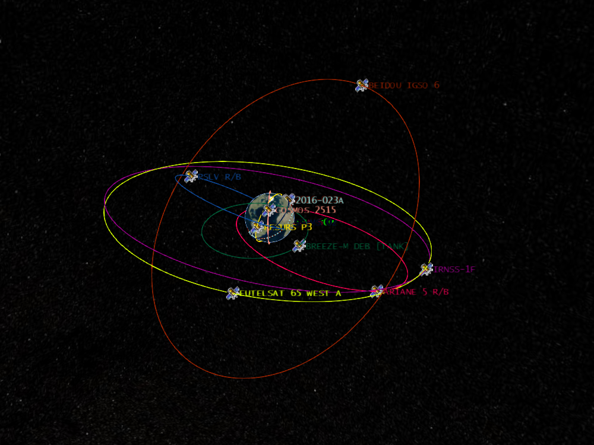

# tle2czml


Python package which takes in Two Line Element's (TLE's) and returns a czml file visualising their orbits.  
  
<a href="https://pypi.python.org/pypi/tle2czml">https://pypi.python.org/pypi/tle2czml</a>


## Background  
CZML is a JSON format for describing a time-dynamic graphical scene, primarily for display in a web browser running <a href="https://cesiumjs.org/">Cesium</a>.  
A <a href="https://www.celestrak.com/NORAD/documentation/tle-fmt.asp">TLE</a> is a data format encoding a list of orbital elements of an Earth-orbiting object for a given point in time.  

This package uses <a href="https://pypi.python.org/pypi/sgp4/">sgp4.py</a> to predict the satellites fututure postion, and a slightly modified <a href="https://github.com/cleder/czml">czml.py</a> to create the .czml files.  



## Requirements
* python3
* pip
* Text file containing list of two line elements, example: 

```
ISS (ZARYA)             
1 25544U 98067A   20293.22611972  .00000497  00000-0  17003-4 0  9991
2 25544  51.6436  94.7185 0001350  46.8729 126.5595 15.49312821251249
KESTREL EYE IIM (KE2M)  
1 42982U 98067NE  20293.11355452  .00022129  00000-0  15728-3 0  9999
2 42982  51.6336   8.5058 0001619 215.9884 144.1006 15.73808685170523
DELLINGR (RBLE)         
1 43021U 98067NJ  20292.66572402  .00020201  00000-0  13900-3 0  9998
2 43021  51.6343   8.5926 0000331  53.4398 306.6632 15.74631224166254
UBAKUSAT
1 43467U 98067NQ  20293.19063114  .00070844  00000-0  29473-3 0  9996
2 43467  51.6335   1.3662 0002867   6.9343 353.1700 15.85064344139669
CUBERRT
1 43546U 98067NU  20292.65915576  .00130902  00000-0  58528-3 0  9997
2 43546  51.6326   6.1225 0002465  18.8688 341.2406 15.83306046129681
```

## Install
`pip install tle2czml`

## Usage
```python
import tle2czml

# Creates a file in the current directory called "orbit.czml", containing the orbits of the satelites over the next 24 hours.
tle2czml.create_czml("tle.txt")
```

```python
import tle2czml
from datetime import datetime

# You can specify the time range you would like to visualise
start_time = datetime(2020, 10, 1, 17, 30)
end_time = datetime(2020, 10, 2, 19, 30)
tle2czml.create_czml("tle.txt", start_time=start_time, end_time=end_time)
```

```python
import tle2czml

# You can also specify a different output path
tle2czml.create_czml("tle.txt", outputfile_path="other_orbit_file.czml")
```

## View Orbits
To view the orbits, go to https://cesiumjs.org/Cesium/Build/Apps/CesiumViewer/ and drag the .czml file into the browser.
(Click the "Play" button in the bottom left corner to start the visualisation)  

You can find up to date TLE's for most satellites on https://www.celestrak.com/NORAD/elements/

## To Do
* Add command line script
* Allow users to login with space-track.org
* Add ability to select base64 image to use for satellite
* Add ability to generate html file with cesium globle displaying czml file
